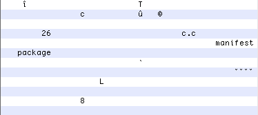

# Playing APK Golf

## Reducing an Android APK's size by 99.99%

In golf, the smallest score wins.

Let's apply that principle to Android. We're going to play APK golf, and create the smallest possible app that can be installed on a device running Oreo.

## Measuring a Baseline
We'll start off with a default app generated by Android Studio. Let's [create a keystore](https://developer.android.com/studio/publish/app-signing.html#generate-key), sign the app, and measure the file size in bytes using `stat -f%z $filename`.

We'll also install the APK on a Nexus 5x running Oreo, to ensure that everything works.


Beautiful. Our APK weighs in at approximately 1.5Mb.

## APK Analyser
1.5Mb seems like a lot considering what our app does, so let's explore the project and search for any quick wins. Android Studio has generated:

- A `MainActivity`, which extends `AppCompatActivity`.
- A layout file with a `ConstraintLayout` root view.
- Values files containing three colours, one string resource, and a theme.
- The `AppCompat` and `ConstraintLayout` support libraries.
- One `AndroidManifest.xml`
- Square, round, and foreground launcher icon PNGs.

The icons seem like the easiest target, given that there are 15 images overall, and 2 XML files under `mipmap-anydpi-v26`. Let's quantify that using Android Studio's [APK Analyser](https://developer.android.com/studio/build/apk-analyzer.html).


Contrary to our initial assumptions, it appears that our Dex file is the largest, and that resources only take up 20% of the APK size.

| File                 | Size           |
| -------------        |-------------|
| `classes.dex`        | 74% |
| `res`                  | 20% |
| `resources.arsc`     | 4% |
| `META-INF`           | 2% |
| `AndroidManifest.xml`| <1% |

Let's investigate what each file does individually.

### Dex file
`classes.dex` is the biggest culprit at 73%, and is therefore our first target. This file contains all our compiled code in the [Dex format](https://source.android.com/devices/tech/dalvik/dex-format), and also references external methods in the Android framework and support library.

The `android.support` package references over 13,000 methods, which seems excessive for a Hello World app.

### Resources
Our res directory has a vast number of layout files, drawables, and animations that were not immediately visible in Android Studio's UI. Again, these have been pulled in from the support library, and weigh in at around 20% of the APK size.


The `resources.arsc` file also contains a reference to each one of these resources.

### Signing
The `META-INF` folder contains `CERT.SF`, `MANIFEST.MF`, and `CERT.RSA` files, which are required for the [v1 APK signature](https://source.android.com/security/apksigning/v2#v1-verification). If an attacker modifies the code within our APK, the signature won't match, meaning the user will be saved from executing the third-party malware.

`MANIFEST.MF` lists the files in the APK, whereas `CERT.SF` contains a digest of the manifest, and also an individual digest of each file. `CERT.RSA` contains a public key which is used to verify the integrity of `CERT.SF`.


There are no *obvious* targets here.

### AndroidManifest
The AndroidManifest looks very similar to our original input file. The only exception is that resources such as strings and drawables have been replaced with integer resource ids, starting with `0x7F`.

## Enable minification
We haven't tried enabling minification and resource shrinking in our app's `build.gradle` file. Let's give that a go.

```bash
android {
    buildTypes {
        release {
            minifyEnabled true
            shrinkResources true
            proguardFiles getDefaultProguardFile(
              'proguard-android.txt'), 'proguard-rules.pro'
        }
    }
}
```

```
-keep class com.fractalwrench.** { *; }
```

Setting `minifyEnabled` to true enables [Proguard](https://www.guardsquare.com/en/proguard), which strips unused code from our application. It also obfuscates symbol names, making it harder to reverse-engineer the app.

`shrinkResources` will remove any resources from our APK which aren't referenced directly. This can cause probles if you're using reflection to access resources indirectly, but that doesn't apply to our app.

## 786 Kb (50% reduction)
We've reduced our APK size by half, with no noticeable effect on our application.


If you haven't already enabled `minifyEnabled` and `shrinkResources` in your application, this is the single most important thing you should take away from this post. You can easily save **several megabytes of space**, with only a couple of hours of configuration and testing.

## AppCompat, we hardly knew ye
`classes.dex` now takes up 57% of the APK. The majority of the method references in our Dex file belong to the `android.support` package, so we're going to remove the support library. To do this, we will:

- Remove the dependencies block from our `build.gradle` entirely

```bash
dependencies {
    implementation 'com.android.support:appcompat-v7:26.1.0'
    implementation 'com.android.support.constraint:constraint-layout:1.0.2'
}
```

- Update the MainActivity to extend `android.app.Activity`

```
public class MainActivity extends Activity
```

- Update our layout to use a single `TextView`.

```
<?xml version="1.0" encoding="utf-8"?>
<TextView xmlns:android="http://schemas.android.com/apk/res/android"
    android:layout_width="match_parent"
    android:layout_height="match_parent"
    android:gravity="center"
    android:text="Hello World!" />
```

- Delete `styles.xml` and remove the `android:theme` attribute from the ``<application>`` element in the `AndroidManifest`
- Delete `colors.xml`
- Do 50 push-ups while gradle syncs

## 108 Kb bytes (87% reduction)
Holy cow, we just achieved an approximate 10x reduction from 786Kb, down to 108Kb. The only discernible change is the Toolbar colour, which now uses the default OS theme.


The res directory now takes up 95% of our APK size, due to all those launcher icons. If these PNGs were provided by our designer, then we could try [converting them to WebP](https://developer.android.com/studio/write/convert-webp.html), which is a more efficient file format supported on API 15 and above.

Fortunately, Google has already optimised our drawables, although if this wasn't the case, [ImageOptim](https://imageoptim.com/mac) could also optimise and strip unnecessary metadata from the PNGs.

Let's be a bad citizen, and replace all our launch icons with a single 1-pixel black dot, placed in the unqualified `res/drawable` folder. This image weighs in at 67 bytes.

## 6808 bytes (94% reduction)
We've got rid of nearly all our resources, so it's not too surprising we've seen a reduction in our APK size of around 95%. The following items are still referenced by `resources.arsc`:

- 1 layout file
- 1 string resource
- 1 launcher icon

Let's start at the top.

### Layout file (6262 bytes, 9% reduction)
The Android framework will [inflate our XML file](https://developer.android.com/reference/android/view/LayoutInflater.html), and automatically create a `TextView` object to set as the `contentView` of the `Activity`.

We could try skipping the middleman by removing the XML file, and setting the contentView programmatically. The size of our resources will decrease as there's one less XML file, but our Dex file will increase, as we'll be referencing additional `TextView` methods.

```
TextView textView = new TextView(this);
textView.setText("Hello World!");
setContentView(textView);
```

Looks like our tradeoff has worked, and we're down to 5710 bytes.

### App Name (6034 bytes, 4% reduction)
Let's delete `strings.xml`, and replace `android:label` in the AndroidManifest with "A". This may seem like a small change, but removes an entry from `resources.arsc`, reduces the number of characters in the manifest, and removes a file from the res directory. Every little helps - we've just saved 228 bytes.

### Launcher icon (5300 bytes, 13% reduction)
The [documentation for resources.arsc](https://android.googlesource.com/platform/frameworks/native/+/jb-dev/libs/utils/README) in the Android Platform repository informs us that each resource in the APK is referenced by `resources.arsc` with an integer ID. These IDs have two namespaces:

>0x01: system resources (pre-installed in framework-res.apk)

>0x7f: application resources (bundled in the application .apk)

So what happens to our APK if we reference a resource in the 0x01 namespace? We should be able to get a nicer icon, and simultaneously reduce our file size.

```
android:icon="@android:drawable/btn_star"
```


It goes without saying, but you should **never trust system resources** like this in a production app. This step will fail Google Play validation, and considering that certain manufacturers have been known to redefine the [colour white](https://www.reddit.com/r/androiddev/comments/71fpru/android_color_resources_not_safe/), proceed with caution.

### Manifest (5252 bytes, 1% reduction)
We haven't touched the manifest yet.

```bash
android:allowBackup="true"
android:supportsRtl="true"
```

 Removing these attributes saves us 48 bytes.

### Proguard hack (4984 bytes, 5% reduction)
It looks like `BuildConfig` and `R` are still included in the Dex file.

```
-keep class com.fractalwrench.MainActivity { *; }
```

Refining our Proguard rule will strip these classes out.

### Obfuscation (4936 bytes, 1% reduction)
Let's give our Activity an obfuscated name. Proguard does this automatically for regular classes, but as the Activity class name can be invoked via Intents, this isn't obfuscated by default.

>MainActivity -> c.java

>com.fractalwrench.apkgolf -> c.c

## META-INF (3307 bytes, 33% reduction)
Currently we're signing our app with both a v1 and v2 signature. This seems wasteful, particularly as v2 offers [superior protection and performance](https://source.android.com/security/apksigning/#apk-signing-schemes), by hashing the entire APK.

Our v2 signature isn't visible in the APK analyser, as it's included as a binary block within the APK file itself. Our v1 signature is visible, in the form of `CERT.RSA` and `CERT.SF` files.

Let's uncheck the v1 signature checkbox in the Android Studio UI and generate a signed APK. We'll also attempt the same in reverse.

| Signature                 | Size           |
| -------------        |-------------|
| v1        | 3511 |
| v2        | 3307 |


Looks like we'll be using v2 from now on.

## Where we're going, we don't need IDEs
It's time to edit our APK by hand. We'll be using the following commands:

```bash
# 1. Create an unsigned apk
./gradlew assembleRelease

# 2. Unzip archive
unzip app-release-unsigned.apk -d app

# Do any edits

# 3. Zip archive
zip -r app app.zip

# 4. Run zipalign
zipalign -v -p 4 app-release-unsigned.apk app-release-aligned.apk

# 5. Run apksigner with v2 signature
apksigner sign --v1-signing-enabled false --ks $HOME/fake.jks --out signed-release.apk app-release-unsigned.apk

# 6. Verify signature
apksigner verify signed-release.apk
```

A detailed overview of APK signing can be found [here](https://developer.android.com/studio/publish/app-signing.html#sign-manually). In summary, gradle generates an unsigned archive, zipalign changes the byte alignment of uncompressed resources to improve RAM usage when the APK is loaded, then finally, the APK is cryptographically signed.

Our unsigned and unaligned APK weighs in at 1902 bytes, which indicates that this process adds around 1Kb.

### File-size discrepancy (2608 bytes, 21% reduction)
Weird! Unzipping the unaligned APK and signing it manually removes `META-INF/MANIFEST.MF`, saving us 543 bytes. If anybody knows why this is the case, please get in touch!

We're now down to 3 files in our signed APK. However, we can also get rid of `resources.arsc`, because we're not defining any resources!

That leaves us with the manifest and the `classes.dex` file, each of which are roughly the same size.

### Compression Hacks (2599 bytes, 0.5% reduction)
Let's change all our remaining strings to 'c', update our versions to 26, then generate a signed APK.

```bash
compileSdkVersion 26
    buildToolsVersion "26.0.1"
    defaultConfig {
        applicationId "c.c"
        minSdkVersion 26
        targetSdkVersion 26
        versionCode 26
        versionName "26"
    }
```

```
<manifest xmlns:android="http://schemas.android.com/apk/res/android"
    package="c.c">

    <application
        android:icon="@android:drawable/btn_star"
        android:label="c"
        >
        <activity android:name="c.c.c">
```
This has saved us 9 bytes.

Although the character count in the file hasn't changed, we have altered the frequency of the 'c' character. This allows the compression algorithm to further reduce the file size.

### Hello ADB (2462 bytes, 5% reduction)
We can optimise our manifest further by removing the Launch intent filter for our activity. From now on, we'll use the following command to launch our app:

```bash
adb shell am start -a android.intent.action.MAIN -n c.c/.c
```

Here's our new manifest:

```
<manifest xmlns:android="http://schemas.android.com/apk/res/android"
    package="c.c">

    <application>
        <activity
            android:name="c"
            android:exported="true" />
    </application>
</manifest>
```

We've also got rid of our launcher icon.

### Reducing method references (2179 bytes, 12% reduction)
Our original requirements were to produce an APK that installs on a device. It's time for Hello World to go.

Our app references methods in `TextView`, `Bundle`, and `Activity`. We can reduce our Dex file size by removing this activity, and replacing it with a custom `Application` class. Our dex file should now only reference a single method - the constructor of `Application`.

Our source files now look like this:

```
package c.c;
import android.app.Application;
public class c extends Application {}
```

```
<manifest xmlns:android="http://schemas.android.com/apk/res/android"
    package="c.c">
    <application android:name=".c" />
</manifest>
```

We'll use adb to verify that the APK installed successfully, and can also check via the Settings app.


### Dex Optimisation (1961 bytes, 10% reduction)
I spent several hours researching the [Dex file format](https://source.android.com/devices/tech/dalvik/dex-format) for this optimisation, as various mechanisms such as checksums and offsets make manual editing hard.

 However, to cut a long story short, it turns out that the only requirement for APK installation is that a  `classes.dex` file must exist. Therefore, we're simply going to delete the original file, run `touch classes.dex` in the terminal, and gain a 10% reduction by using an empty file.

 Sometimes the stupidest solution is the best.

### Understanding the Manifest (1961 bytes, 0% reduction)
Our manifest from the unsigned APK is in a binary XML format which doesn't appear to be officially documented. We can use the [HexFiend](https://github.com/ridiculousfish/HexFiend) editor to manipulate the file contents.

We can guess at a couple of interesting items in the file header - the first four bytes encode `38`, which is the same version number used for the Dex file. The next two bytes encode `660`, which is conveniently the file size.

Let's try deleting a byte by setting the targetSdkVersion to `1`, and updating the file size header to `659`. Unfortunately the Android system rejects this as an invalid APK, so it looks like there's some additional complexity here.

## Not understanding the Manifest (1777 bytes, 9% reduction)
Let's enter dummy characters throughout the file, then attempt to install the APK, *without* changing the file size. This will determine whether there's a checksum in place, or if our changes invalidated offset values in the file header.

Surprisingly, the following manifest is interpreted as a valid APK on a Nexus 5X running Oreo:


I think I can hear the Android Framework Engineer responsible for maintaining `BinaryXMLParser.java` screaming very loudly into a pillow.

To maximise our gains, we're going to replace these dummy characters with null bytes. This will make it easier to see the important parts of the file in HexFiend, and also gain bytes from our earlier compression hack.

### UTF-8 Manifest
These are the essential components of the Manifest, without which the APK fails to install.



A few things are immediately obvious - such as the manifest and package tags. The versionCode and package name are also found in the string pool.

### Hexadecimal Manifest


Viewing the file in hexadecimal shows values in the file header which describe the string pool and other values, such as the file size of `0x9402`. Strings also have an interesting encoding - if they exceed 8 bytes, their total length is specified in the 2 preceding bytes.

However, it doesn't look like there's much more scope for gains here.

## Done? (1757 bytes, 1% reduction)
Let's inspect the final APK.


After all this time, I left my name in the APK via the v2 signature. Let's create a new keystore that exploits the compression hack.


That saved us 20 bytes.

## Stage 5: Acceptance
`1757` bytes is pretty damn small, and as far as I'm aware, this is the smallest APK in existence.

However, I'm reasonably confident that someone out there in the Android community can make further optimisations which will beat my score. If you manage to improve on `1757` bytes, please [send a PR to the repository](https://github.com/fractalwrench/ApkGolf) where the smallest APK is hosted, or [get in touch via Twitter](https://twitter.com/fractalwrench).

## Thank You
I hope you've enjoyed learning about the internals of an Android APK. If you have any questions, feedback, or would like to suggest a topic for me to write about, please [get in touch via Twitter](https://twitter.com/fractalwrench)!
